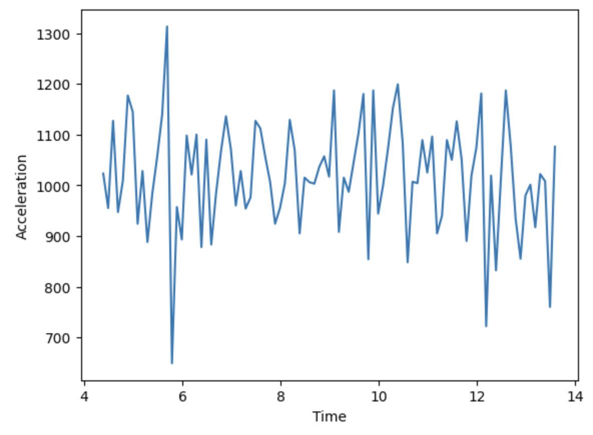

# Step Counter Project

Build a step counter that analyzes accelerometer data from a phone or fitness tracker.

## How It Works

When you walk, your phone's accelerometer detects movement changes. Large increases in acceleration usually mean you took a step.

Let's refresh on the difference between:

- Position: Where you are.
- Velocity: How fast you are moving.
- Acceleration: How quickly your speed is increasing/decreasing.

Stand up and take a few steps around the classroom. During each step (from pushing off the ground with your foot to landing back on the ground):

1. When is your acceleration positive?
2. When is your acceleration negative?

Think about how the acceleration changes throughout the step. 3. When does your foot increase acceleration the most? 4. When does your foot decrease acceleration the most?

We can calculate when the foot **pushes off** the ground by finding when the acceleration **increases the fastest**. Similarly, we can find when the foot **lands on** the ground by finding when the acceleration **decreases the fastest**.

We could look for either of these indicators to mark when a user takes a step. For this project, we'll choose when the foot pushes off the ground, or when the acceleration increases the most sharply.

A short sample of acceleration data is plotted below as a visual aid in understanding:

5. Where is the acceleration increasing? Where is the acceleration decreasing?
6. How could we calculate how much the acceleration has increased or decreased since the last moment in time? What mathematical operation (+, -, \*, /) would we use?

Some natural variation in acceleration while a person is walking is expected. These may be lots of reasons why the acceleration increases/decreases a small amount:

- An untimely gust of wind pushes someone forward a bit faster.
- You notice and start reading a sign on the side of the road, slowing down just a little bit while still walking.
- Etc.

Thus, we only want to consider LARGE changes to indicate a step. We'll do this by using a **threshold** value - only increases larger than this number are considered steps to skip small, natural variations.

## Setup

We've provided a short recording of acceleration data in `data/sample_data.csv`. CSV stands for "comma-separated values" and works much like a spreadsheet - each line indicates a row of sequential data, and each individual piece of data is separated by commas.

A helpful function to read this data into two lists is provided in `data/utils.py`. We are using the `csv` standard library - we'll talk more about what that means in the next unit, so don't worry too much about this magic for now.

You'll be working in `project_work.py`. Some code is already provided, but you need to write the important functions.

## Your Task

First, you'll code your microbit to record your own steps using the in-built accelerometer. Then, you'll gather your own step data.

After transferring the data to your laptop, compute the number of steps the user took in this accelerometer recording by completing the 3 functions in `project_work.py` according to the steps below:

## Microbit Data Collection

Copy the code in `microbit_starter.py` to the microbit editor at https://python.microbit.org/v/3/. Then fill in the code so that it logs the acceleration using `accelerometer.get_strength()`

After this is complete, download the code onto your microbit, plug it in, and walk around the room. It will be collecting your accelerometer data as you walk. Then, return to your desk and plug your microbit back into your laptop. 

Follow the instructions on the slides to download the csv and move it to your project. Right now, the code is configured to read the file located in `data/sample_data.csv`. You can change the filename at the bottom of the code in `project_work.py` to read from a differently named file. Change it to read the file you just downloaded from the microbit.

## Step 1: get_changes()

**Goal** - Calculate the difference between each pair of consecutive acceleration values..

**Why?** - We want to find where the acceleration is increasing or decreasing, so we need to calculate how the acceleration changes as time progresses. A large increase indicates a user pushing off the ground for a new step.

**Implementation:**

- Loop through the magnitudes list
- For each position i, calculate the change in acceleration between the current data point and the next: `magnitudes[i+1] - magnitudes[i]`
- Add the result to your changes list

**Questions to Ponder**:

- If we need to access `magnitudes[i+1]`, what should we pass to the `range()` function in our for loop to make sure we aren't accessing an invalid index?

**Success check:** Run `python tests.py`. The first test should pass.

**Expected result:** If magnitudes are [10, 15, 12, 18], changes should be [5, -3, 6].

## Step 2: count_peaks()

**Goal** - Count how many acceleration changes are above the threshold.

**Why?** - Large **_positive_** changes indicate a user is pushing off the ground for a new step, but smaller changes could mean anything and should not be counted.

**Implementation:**

- Set counter to 0
- Loop through the changes list
- If a change is greater than threshold, add 1 to counter
- Return the counter

**Success check:** Second test should pass.

**Expected result:** With threshold 100 and changes [50, -30, 150, 75, -10, 200], should count 2.

## Step 3: count_steps()

**Goal**: Call the two functions you just wrote to count the number of steps in the sample data.

**How to implement:**

- Call `get_changes()` with the acceleration magnitudes
- Call `count_peaks()` with the resulting acceleration changes and step threshold
- Return the result

**Success check:** All tests should pass.

**Expected result:** Should detect around 10-20 steps in the sample data.

## Testing Your Work

Run `python tests.py` after each function. Tests will tell you exactly what's wrong and give hints.

Run `python project_work.py` to see your final results.

## Common Mistakes

- Off-by-one errors in loops
- Not handling empty lists
- Forgetting to return values from functions

## When You're Done

All tests pass and `python project_work.py` shows reasonable results (detecting some steps but not too many).

After you are finished, you can try:

- Use different threshold values by changing the STEP_THRESHOLD variable in your code. What does increasing or decreasing the threshold change about the result?
- Use the `pyplot` library to create a plot of the data like at the top of this README!
